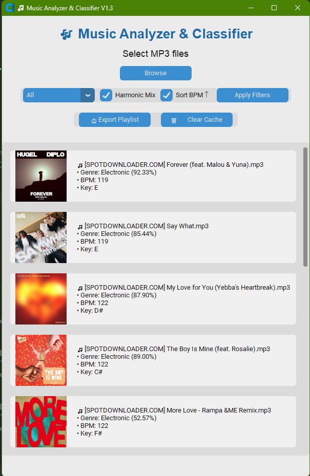

# Music Analyzer for Djs

This python app is made for those who need to organise a dj set but have problems mixing in key and bpm at the same time (as rekordbox only offers one or the other)
This project uses a CNN for the music Genre, and simple KEY and BPM detection.

## Installation

Use the package manager [pip](https://pip.pypa.io/en/stable/) to install all the necessary libraries used for this project.

```bash
pip install -r requeriments.txt
```

## Usage

```python
>> python app.py
# A GUI will show
```

## Contributing

Pull requests are welcome. For major changes, please open an issue first
to discuss what you would like to change.

Please make sure to update tests as appropriate.

## How it works
Very intuitive, just open the GUI, select or drag and drop some music, and then filter however you want.




[MIT](https://choosealicense.com/licenses/mit/)
